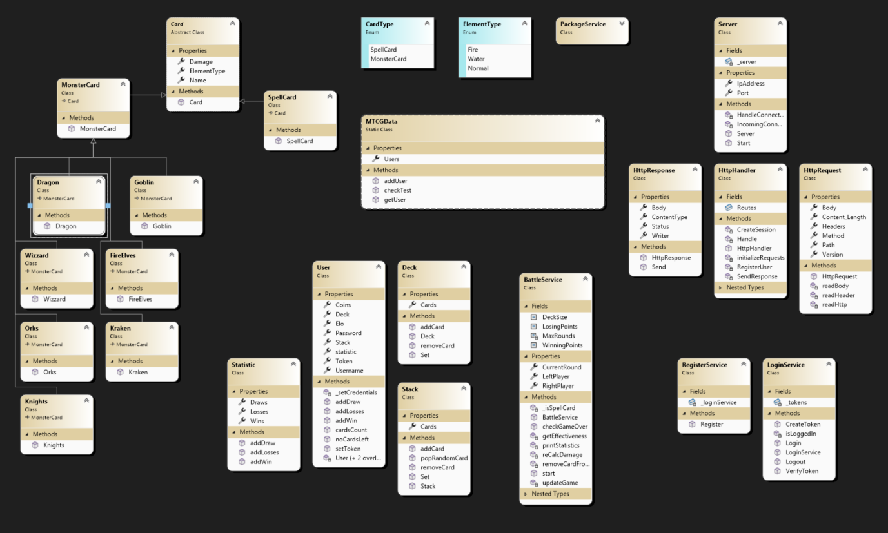

# Monster Trading Card Game (MTCG) - REST Server

This project implements a basic REST server in C# for a Monster Trading Card Game (MTCG). The server listens to incoming HTTP requests, performs request- and response-parsing, and routes the requests to defined API endpoints for user registration and login. 

The current version focuses on setting up the foundational features, ensuring the system is capable of handling basic authentication and user management. 

## Features

- **REST Server**: A lightweight server that listens for client requests.
- **HTTP Protocol Handling**: Request and response parsing based on the HTTP protocol.
- **Routing**: Custom routing functionality to map API endpoints to the appropriate logic.
- **REST API Endpoints**: 
  - **Register**: Allows users to register with their credentials.
  - **Login**: Authenticates users based on the provided credentials.
  
### Functional Requirements
- **Model Classes**: 
  - **User**: Stores user information such as username, password, and token.
  - **Cards**: A placeholder for the card structure to be implemented later.
- **User Management**: 
  - In-memory user storage (no persistent database at this point).
  - Token-based user authentication.

### Non-functional Requirements
- **Token-based Security**: 
  - A token is generated upon successful login and stored with the user details.
- **Integration Tests**: 
  - Provided CURL scripts for integration testing (up to the user login functionality).

### Overview

## How to Run

1. Clone this repository from GitHub.
2. Build and run the server using your preferred C# environment (e.g., Visual Studio).
3. Start Program.cs
4. Use the provided CURL scripts or a REST client (e.g., Postman) to interact with the API endpoints.

## Testing

To test the current functionality, use the provided CURL scripts. The integration tests cover user registration and login up to the token generation phase.

## Contributing

Please refer to the [GitHub repository](#) for contribution guidelines and further details.
